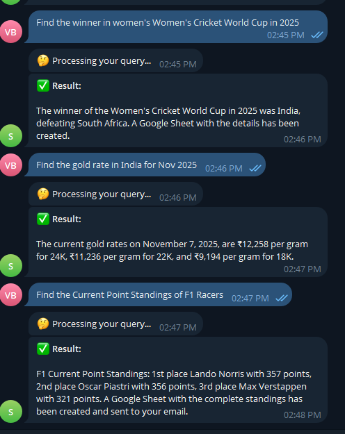
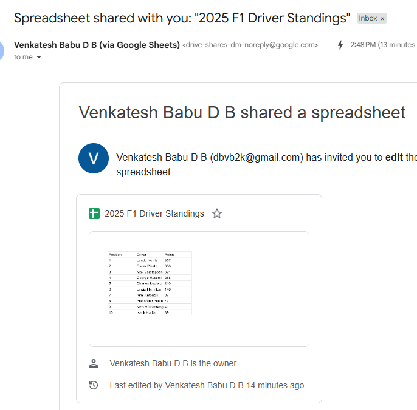
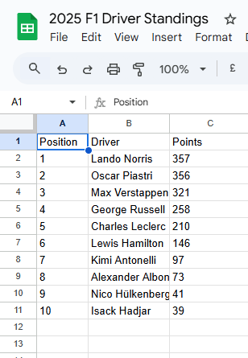

# Agentic AI Application with Telegram, Gmail, and Google Sheets Integration

A sophisticated Agentic AI application that processes user queries from Telegram, stores results in Google Sheets, and notifies users via Gmail.

## 🚀 Features

- **Telegram Bot Integration**: Receive and process queries from users via Telegram
- **Web Search**: Use DuckDuckGo to find information on the web
- **Google Sheets**: Automatically create and populate sheets with results
- **Gmail Integration**: Email sheet links to users
- **Document Processing**: Extract and search through local documents using FAISS
- **Modular Architecture**: MCP (Model Context Protocol) servers for different capabilities

## 📋 Quick Start

### Prerequisites

1. **Python 3.11+**
2. **Telegram Bot Token** (from [@BotFather](https://t.me/BotFather))
3. **Google Cloud Project** with APIs enabled:
   - Google Sheets API
   - Gmail API
   - Google Drive API
4. **Ollama** running locally (for embeddings and LLM fallback)

### Installation

```bash
# Clone the repository
git clone <your-repo-url>
cd Session-8

# Install dependencies
uv sync

# Or using pip
pip install -r requirements.txt
```

### Configuration

1. Copy the example config:
```bash
cp config.py.example config.py
```

2. Edit `config.py` with your credentials:
   - Telegram bot token
   - Gmail sender/receiver addresses
   - Google credentials path

3. Set up Google credentials:
   - Download service account JSON from Google Cloud Console
   - Save as `credentials/google_credentials.json`
   - For Gmail, also set up OAuth2 credentials (see SETUP.md)

4. Configure Telegram bot:
   - Get token from @BotFather
   - For production, set up webhook

See `SETUP.md` for detailed instructions.

## 🏃 Running the Application

### Production Mode (Webhook)

Start the Telegram webhook server:

```bash
python telegram_webhook.py
```

The server will run on port 8001 by default.

### Development Mode

Run the main agent locally:

```bash
python agent.py
```

Enter your query when prompted.

## 📖 Usage Example

### Via Telegram

1. Open Telegram and find your bot
2. Send `/start` to initialize
3. Send a query: "Find the Current Point Standings of F1 Racers"
4. Receive an email with the Google Sheet link

### Via Local Agent

```bash
python agent.py
# Enter your query when prompted
```

## 🏗️ Architecture

### MCP Servers

The application uses multiple MCP servers for different capabilities:

1. **mcp_server_1.py**: Math and calculator tools
2. **mcp_server_2.py**: Document processing with FAISS
3. **mcp_server_3.py**: Web search (DuckDuckGo)
4. **mcp_server_4_googlesheets.py**: Google Sheets integration
5. **mcp_server_5_gmail.py**: Gmail integration
6. **mcp_server_6_telegram.py**: Telegram bot integration

### Core Components

- **agent.py**: Main entry point
- **core/loop.py**: Agent execution loop
- **core/session.py**: MCP session management
- **core/context.py**: Agent context
- **core/strategy.py**: Decision making
- **modules/**: Agent modules (perception, action, memory, etc.)

### Workflow

1. User sends message to Telegram bot
2. Webhook forwards query to agent
3. Agent processes query using available tools
4. Results stored in new Google Sheet
5. Sheet link emailed to user via Gmail

## 📸 Screenshots

### Telegram Bot Interaction


*Screenshot showing the Telegram bot interface with user queries and responses*

### Gmail Notification


*Screenshot showing the email notification with the Google Sheet link*

### Google Sheet Results


*Screenshot showing the automatically created Google Sheet with query results*


## 🔧 Configuration Files

- **config.py**: Main configuration (credentials, ports, etc.)
- **config/profiles.yaml**: Agent profiles and MCP server configs
- **config/models.json**: LLM model configurations

## 📝 Environment Variables

You can also use environment variables for sensitive data:

```bash
export TELEGRAM_BOT_TOKEN="your_token"
export SENDER_EMAIL="your_email@gmail.com"
export GOOGLE_CREDENTIALS_PATH="credentials/google_credentials.json"
```

## 🔒 Security

- Never commit `config.py` or credential files
- Use environment variables in production
- Keep bot tokens secret
- Regularly rotate API keys
- Add `credentials/` to `.gitignore`

## 🐛 Troubleshooting

### Gmail API Errors

- Ensure Gmail API is enabled in Google Cloud Console
- Configure OAuth consent screen
- Run `python credentials_setup.py` to authenticate Gmail

### Google Sheets Permissions

- Share sheets with service account email
- Check `client_email` in `google_credentials.json`
- Ensure proper IAM roles

### Telegram Bot Not Responding

- Verify bot token
- Check webhook is set correctly
- Review server logs
- Ensure bot is not blocked

## 📚 Documentation

- **SETUP.md**: Detailed setup instructions
- **config.py.example**: Configuration template
- Each MCP server has inline documentation

## 🤝 Contributing

1. Fork the repository
2. Create a feature branch
3. Make your changes
4. Submit a pull request

## 📄 License

[Your License Here]

## 🙏 Acknowledgments

- FastMCP for MCP server framework
- Google Cloud Platform for APIs
- Telegram for bot platform
- Ollama for local LLM support

## 📞 Support

For issues and questions:
- Check SETUP.md for common problems
- Review logs for error messages
- Verify all credentials are correct
- Test each component individually

